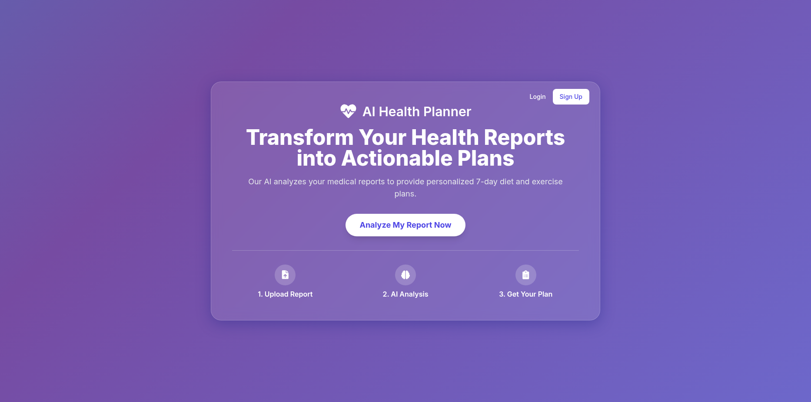
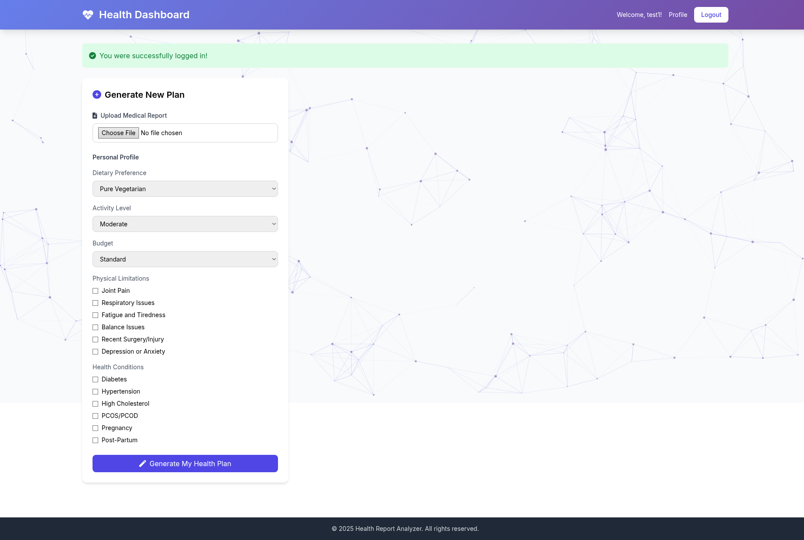
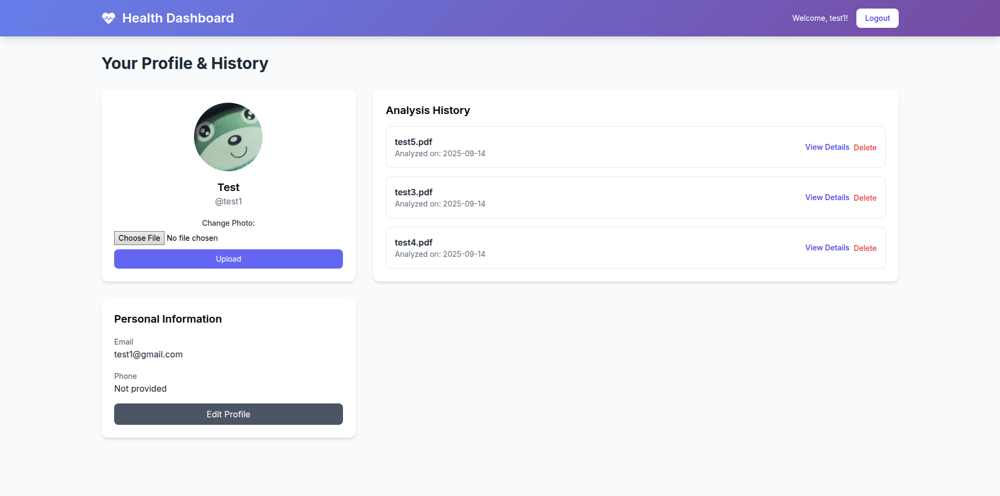
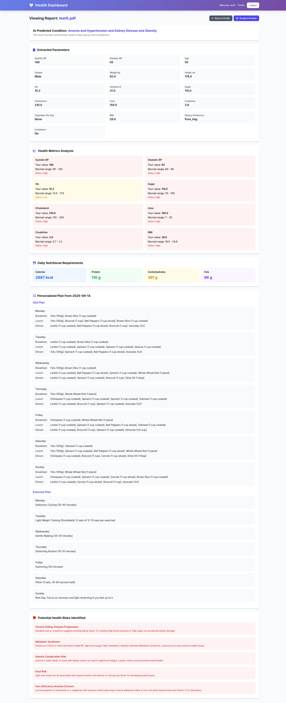

# Medical Report Analyzer and Fitness Analysis

## Introduction

This project is a web-based application that analyzes medical reports and provides personalized fitness and diet plans. Users can upload their medical reports (in PDF or image format), and the application will extract relevant health parameters, predict potential health conditions, and generate a 7-day diet and exercise plan. The application also includes user authentication, profile management, and the ability to view past reports.

---

## Working

The application's workflow is as follows:

1.  **User Authentication**: Users can sign up for a new account or log in to their existing account. User data is stored in a SQLite database.
2.  **File Upload**: Once logged in, users can upload a medical report file (PDF, PNG, JPG, or JPEG) through the dashboard.
3.  **Text Extraction**: The application extracts text from the uploaded file. For PDF files, it uses the `pdfplumber` library. If the PDF contains scanned images or minimal text, it falls back to OCR using `pdf2image` and `pytesseract`. For image files, it uses `pytesseract` directly.
4.  **Parameter Extraction**: The extracted text is then processed by a Natural Language Processing (NLP) module that uses regular expressions to identify and extract key medical parameters such as blood pressure, blood sugar, cholesterol, and more.
5.  **Health Analysis**:
    * **Condition Prediction**: A machine learning model (a Random Forest Classifier) predicts potential health conditions based on the extracted parameters.
    * **Risk Analysis**: A rule-based expert system analyzes the parameters to identify potential future health risks.
6.  **Plan Generation**:
    * **Diet Plan**: A 7-day diet plan is generated based on the user's dietary preferences, health conditions, and nutritional requirements. The application uses a `food_database.json` file to create the meal plan.
    * **Exercise Plan**: A 7-day exercise plan is created based on the predicted health conditions and any physical limitations indicated by the user. The application uses an `exercise_database.json` file to generate the plan.
7.  **Report Generation and Storage**: The extracted parameters, predicted condition, health risks, and personalized plans are saved to the database and displayed to the user in a detailed report view.

---

## Outputs

### index.html

The landing page of the application, which provides a brief introduction to the project and links to the login and signup pages.

### dashboard.html

After logging in, the user is directed to the dashboard. Here, they can upload their medical reports and input personal profile information such as dietary preferences, activity level, and physical limitations. The dashboard also displays any previously generated plans.

### profile.html

The user's profile page, where they can view and edit their personal information, change their profile photo, and view a history of their analyzed reports.

### report_detail.html

This page displays the detailed results of a medical report analysis, including the extracted parameters, the AI-predicted health condition, a list of potential health risks, and the personalized 7-day diet and exercise plans.

---

## Observation

The application successfully extracts and analyzes key medical parameters from a variety of report formats. The use of a machine learning model for condition prediction and a rule-based system for risk analysis provides a comprehensive overview of the user's health status. The personalized diet and exercise plans are a key feature, offering actionable advice based on the analysis.

---

## Conclusion

The Medical Report Analyzer and Fitness Analysis project is a powerful tool for individuals looking to better understand their health and receive personalized recommendations. By combining OCR, NLP, and machine learning, the application can transform unstructured medical reports into actionable health plans.

---

## Impact

This project has the potential to empower individuals to take a more proactive role in managing their health. By providing accessible and personalized health information, it can help users make more informed decisions about their diet, exercise, and overall well-being. This can lead to improved health outcomes and a greater sense of control over one's health.
